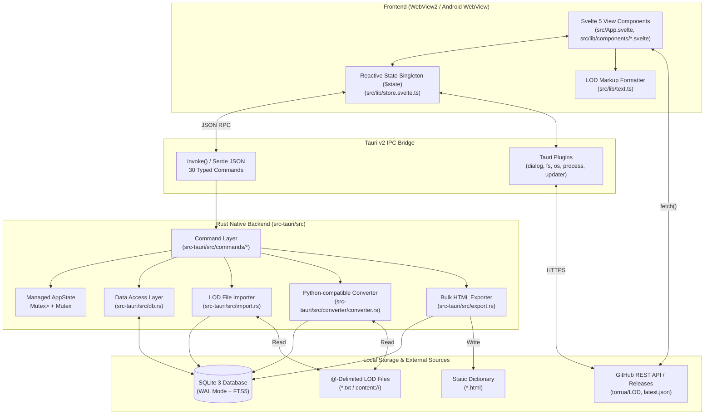

# ARCHITECTURE.md — LOD Manager System Architecture

> **Senior Architect Reference Document**  
> **Version**: 1.7.0 | **Stack**: Tauri v2 · Svelte 5 (Runes) · Rust (2024) · SQLite 3 (FTS5)

---

## 1. High-Level Architecture (C4 Container View)

LOD Manager is an offline-first, cross-platform desktop and mobile application. It uses Tauri v2's IPC command bridge to connect a reactive Svelte 5 WebView frontend with a native Rust backend managing an embedded SQLite 3 database with FTS5 full-text search.



---

## 2. Layered Architecture

### 2.1 Frontend Layers (`src/`)

1. **Presentation / View Layer (`src/App.svelte`, `src/lib/components/*.svelte`)**:
   - Uses Svelte 5 runes (`$props`, `$state`, `$derived`, `$effect`).
   - **No client-side router**: View switching is state-driven via `app.tab` (`'words' | 'events' | 'types' | 'authors'`) and `app.panel` (`'welcome' | 'word' | 'word-form' | 'event' | 'event-form' | 'types' | 'authors'`).
   - **Virtual Scrolling (`Sidebar.svelte`)**: Renders only visible word rows (`ROW_H = 28px`, `±10` overscan buffer) using computed `topPad` and `botPad` spacers, maintaining 60fps with 10,000+ words.

2. **Application State & Action Layer (`src/lib/store.svelte.ts`)**:
   - Exports a single deeply reactive `$state` object (`export const app = $state({...})`) and action functions (`openDb`, `loadWords`, `applyFilter`, `selectWord`, `saveWord`, `searchEnglishNow`, `importFiles`, etc.).
   - Persists UI preferences (`lod-prefs`), theme (`lod-theme`), read-only state (`lod-ro`), sidebar width (`sb-w`), and last opened database path (`lod-last-db`) in `localStorage`.
   - Implements a race-condition guard (`app.loadingWordId`) in `selectWord(id)` so rapid keyboard navigation ignores stale out-of-order IPC responses.

3. **Domain Text Formatting (`src/lib/text.ts`)**:
   - Single-pass HTML escaping (`esc()`) followed by Loglan dictionary markup transformations:
     - `--` → em-dash (`—`), `...` → ellipsis (`…`), `%` → placeholder dash.
     - `«keyword»` → `<span class="kw">keyword</span>`.
     - `{word}` → clickable cross-reference `<span class="xref" data-word="word">word</span>`.

### 2.2 Backend Layers (`src-tauri/src/`)

1. **Command Layer (`src-tauri/src/commands/*.rs`)**:
   - Thin Tauri `#[tauri::command]` wrappers grouped into 8 domain submodules (`database`, `words`, `events`, `types`, `authors`, `search`, `import`, `export`).
   - Uses `with_db` and `with_db_mut` in `commands/mod.rs` to acquire the `Mutex<Option<Connection>>` lock and map `rusqlite::Error` to `Res<T>` (`Result<T, String>`).

2. **Data Access Layer (`src-tauri/src/db.rs`)**:
   - Stateless functions taking `&Connection`.
   - Responsible for schema initialization (`init_schema`, `init_fts`), migrations (`add_missing_indexes`, `migrate_words_unique_if_needed`, `migrate_event_columns_if_needed`), entity CRUD, and 4-strategy English search.

3. **Domain Services (`import.rs`, `export.rs`, `converter/converter.rs`)**:
   - **`import.rs`**: Single-transaction `@`-delimited LOD file parser and importer (`Types → Authors → Events → Words + Spellings → Definitions → Settings`).
   - **`converter/converter.rs`**: Directory-based batch converter mirroring the Python `loglan_converter` tool.
   - **`export.rs`**: 4-query bulk HTML generator avoiding the N+1 query trap (~4 SQL queries instead of ~30,000 for a 10,000-word dictionary).

---

## 3. Database Schema & Indexing Strategy (Aligned with `torrua/loglan_core`)

The database schema originates from [`torrua/loglan_core`](https://github.com/torrua/loglan_core) (`v0.3.2`) and `loglan_convert` (which generates `export.db`).

### 3.1 Canonical `torrua/loglan_core` Tables (11 tables) + `LOD Manager` Extensions

```sql
types (
    id INTEGER PRIMARY KEY AUTOINCREMENT,
    type TEXT NOT NULL UNIQUE, -- Note: UNIQUE in db::init_schema; omitted in loglan_core/type.py
    type_x TEXT NOT NULL,
    "group" TEXT NOT NULL,   -- Canonical loglan_core name ("group"); db.rs currently uses group_
    parentable BOOLEAN NOT NULL DEFAULT TRUE,
    description TEXT,
    created DATETIME, updated DATETIME
)

authors (
    id INTEGER PRIMARY KEY AUTOINCREMENT,
    abbreviation TEXT NOT NULL UNIQUE,
    full_name TEXT,
    notes TEXT,
    created DATETIME, updated DATETIME
)

events (
    id INTEGER PRIMARY KEY AUTOINCREMENT,
    event_id INTEGER NOT NULL UNIQUE,
    name TEXT NOT NULL,
    date DATE,
    definition TEXT,         -- Mapped to EventItem.notes in Rust
    annotation TEXT,
    suffix TEXT,
    created DATETIME, updated DATETIME
)

settings (
    id INTEGER PRIMARY KEY AUTOINCREMENT,
    date DATETIME NOT NULL UNIQUE,
    db_version INTEGER NOT NULL,
    last_word_id INTEGER NOT NULL,
    db_release TEXT NOT NULL,
    created DATETIME, updated DATETIME
)

syllables (
    id INTEGER PRIMARY KEY AUTOINCREMENT,
    name TEXT NOT NULL,
    type TEXT NOT NULL,
    allowed BOOLEAN NOT NULL,
    created DATETIME, updated DATETIME
)

words (
    id INTEGER PRIMARY KEY AUTOINCREMENT,
    name TEXT NOT NULL,      -- NOTE: Not unique across events! (11 duplicate (name, type) pairs in export.db)
    type INTEGER NOT NULL REFERENCES types(id),
    origin TEXT,
    origin_x TEXT,
    "match" TEXT,            -- Canonical loglan_core name ("match"); db.rs currently uses match_
    rank TEXT,
    year DATE,               -- Stored as 'YYYY-01-01' in export.db; year notes in notes.$.year
    notes JSON,              -- JSON dict {"author", "year", "rank"} in loglan_core ('null' string when empty)
    id_old INTEGER NOT NULL, -- Shared across multiple historical spellings (WordSpell) of the same word
    "TID_old" INTEGER,
    event_start INTEGER NOT NULL REFERENCES events(event_id),
    event_end INTEGER REFERENCES events(event_id), -- NULL means active (9999 in WordSpell.txt)
    created DATETIME, updated DATETIME
)

definitions (
    id INTEGER PRIMARY KEY AUTOINCREMENT,
    word_id INTEGER NOT NULL REFERENCES words(id), -- NOTE: No ON DELETE CASCADE in export.db!
    position INTEGER NOT NULL DEFAULT 0,
    body TEXT NOT NULL DEFAULT '',
    usage TEXT,
    grammar_code TEXT,       -- Letter code (e.g. "a", "v", "n"); combined with slots -> "(2a)"
    slots INTEGER,           -- Predicate place count (e.g. 2 in "2a"; populated on 8,558 rows in export.db)
    case_tags TEXT,
    language TEXT,
    notes TEXT,
    created DATETIME, updated DATETIME
)

keys (
    id INTEGER PRIMARY KEY AUTOINCREMENT,
    word TEXT NOT NULL,
    language TEXT NOT NULL,
    created DATETIME, updated DATETIME,
    UNIQUE(word, language)
)

connect_authors (
    "AID" INTEGER NOT NULL REFERENCES authors(id), -- No ON DELETE CASCADE in export.db
    "WID" INTEGER NOT NULL REFERENCES words(id),   -- No ON DELETE CASCADE in export.db
    PRIMARY KEY ("AID", "WID")
)

connect_words (
    parent_id INTEGER NOT NULL REFERENCES words(id), -- No ON DELETE CASCADE in export.db
    child_id INTEGER NOT NULL REFERENCES words(id),  -- No ON DELETE CASCADE in export.db
    PRIMARY KEY (parent_id, child_id)
    -- In loglan_core, links parent words to BOTH derived affixes (type_x='Affix')
    -- and derived complexes ("group"='Cpx')
)

connect_keys (
    "KID" INTEGER NOT NULL REFERENCES keys(id),        -- No ON DELETE CASCADE in export.db
    "DID" INTEGER NOT NULL REFERENCES definitions(id), -- No ON DELETE CASCADE in export.db
    PRIMARY KEY ("KID", "DID")
)
```

_(Note: Because `loglan_core` declares foreign keys in `export.db` without `ON DELETE CASCADE` while `LOD Manager` enables `PRAGMA foreign_keys=ON`, delete operations must explicitly delete child rows from `connect_keys`, `definitions`, `connect_words`, and `connect_authors` before deleting from `words`, `definitions`, or `authors`. `LOD Manager` also defines legacy helper tables `word_affixes`, `word_spellings`, and `word_usage`, which are empty in `export.db`.)_

### 3.2 Full-Text Search Virtual Tables (`db::init_fts`)

- **`def_fts`**: Content-linked FTS5 virtual table (`content='definitions', content_rowid='id', tokenize='unicode61 remove_diacritics 1'`). Indexes full definition bodies and supports `snippet(def_fts, 0, '«', '»', '…', 10)`.
- **`def_kw_fts`**: Standalone FTS5 virtual table (`tokenize='unicode61 remove_diacritics 1'`). Populated by `extract_keywords()` with tokens enclosed in `«...»` guillemets.

---

## 4. Key Data Flows & Query Optimizations

### 4.1 `get_word(id)` — 5-Step Query Pipeline (`db.rs:355-462`)

Instead of issuing separate queries per definition/affix/spelling, `db::get_word` executes 5 targeted queries:

1. **Main Word + Joins**: Fetches `words` row joined with `types` (`t.type`), `events` (`es.name`, `ee.name`).
2. **Affixes & Spellings (Single Round-Trip)**: Uses `GROUP_CONCAT(affix, x'1f')` and `GROUP_CONCAT(spelling, x'1f')` separated by ASCII Unit Separator (`0x1F`) to retrieve both lists in one `SELECT`.
3. **Definitions via `json_group_array`**: Aggregates ordered definitions inside SQLite using `json_group_array(json_object(...))` and deserializes in a single `serde_json::from_str` pass, eliminating separator collision risks.
4. **Used-In (`word_usage`)**: Queries `SELECT DISTINCT used_in_word FROM word_usage WHERE word_id = ?1`.
5. **Children (`connect_words`)**: Queries `SELECT w.name FROM words w JOIN connect_words cw ON cw.child_id = w.id WHERE cw.parent_id = ?1`.

### 4.2 `generate_html()` — 4-Query Bulk Export (`export.rs:148-242`)

1. Loads all matching words (`words LEFT JOIN types`) ordered by `LOWER(w.name)`.
2. Bulk-loads all definitions (`SELECT word_id, grammar_code, usage, body, case_tags FROM definitions ORDER BY word_id, position`) into a Rust `HashMap<i64, Vec<DefRow>>`.
3. Bulk-loads all affixes (`word_affixes`) into `HashMap<i64, Vec<String>>`.
4. Bulk-loads all reverse usages (`word_usage`) into `HashMap<i64, Vec<String>>`.
5. Renders the complete HTML string in memory with `std::fmt::Write`.

---

## 5. Architectural Decision Records (ADRs)

| ID        | Decision                                                | Rationale                                                                                   | Trade-offs                                                                                        |
| --------- | ------------------------------------------------------- | ------------------------------------------------------------------------------------------- | ------------------------------------------------------------------------------------------------- |
| **ADR-1** | **Single `Mutex<Option<Connection>>` in `AppState`**    | Simple ownership, zero connection-pool overhead for a single-user desktop/mobile app.       | Long-running writes (`rebuild_fts`, `compact_db`, large imports) block concurrent reads.          |
| **ADR-2** | **Svelte 5 `$state` Singleton (`store.svelte.ts`)**     | Eliminates store subscription boilerplate (`$store`); direct property access across UI.     | File is ~710 lines; in-place array mutations (e.g., `.sort()`) can trigger unintended UI updates. |
| **ADR-3** | **Client-Side L→E Filtering after Event Load**          | `loadWords()` fetches all words for the active event; `applyFilter()` filters in JS memory. | Instant (<2ms) prefix/wildcard/type filtering without IPC round-trips on every keystroke.         |
| **ADR-4** | **Dual FTS5 Virtual Tables (`def_fts` + `def_kw_fts`)** | Separates full-body search from lexicographical headword (`«keyword»`) search.              | Both tables must be kept in sync in `fts_update` and `rebuild_fts`.                               |
| **ADR-5** | **Android `content://` Copy-on-Open / Content-Pass**    | Android SAF returns `content://` URIs that `rusqlite`/`std::fs` cannot open directly.       | Requires copying DB to `AppData` on open and passing `(filename, utf8)` pairs on import.          |

---

## 6. Current Architectural Divergences & Risks

> **See [AUDIT_REPORT.md](file:///c:/Users/User/OneDrive/JS/LOD%20Manager/AUDIT_REPORT.md) for full root-cause analysis, `torrua/loglan_core` comparison, and remediation steps.**

1. **IPC Field Desynchronization & Ignored `definitions.slots` (`Definition` / `SaveDefinition`)**:
   - Rust `models.rs` uses `grammar_code` and `case_tags`, whereas TypeScript `src/types.ts` and `WordDetail.svelte` use `grammar` and `tags`.
   - In `torrua/loglan_core` (`export.db`), predicate slot counts (`slots INTEGER`) and grammar codes (`grammar_code VARCHAR(8)`) are stored in separate columns (`8,558` definitions in `export.db` have `slots IS NOT NULL`), whereas `LOD Manager` ignores `slots`.
2. **Database Schema Split-Brain vs `torrua/loglan_core` (`export.db`)**:
   - `torrua/loglan_core` uses `"group"` (in `types`) and `"match"` (in `words`), whereas `db.rs`, `import.rs`, and `export.rs` use `group_` and `match_`.
   - `db::init_schema` enforces `UNIQUE(name, type)` on `words`, whereas `loglan_core` allows multiple rows with the same `(name, type)` across different historical events (`event_start` / `event_end`) — causing `LOD Manager` to drop 11 active words on import.
   - `loglan_core` stores affixes (`type_x = 'Affix'`) and complexes (`"group" = 'Cpx'`) in `words` linked via `connect_words`, authors in `connect_authors`, and structured metadata in JSON `words.notes` (with `'null'` strings on 9,879 rows in `export.db`), whereas `db::get_word` queries empty legacy tables (`word_affixes`, `word_usage`) and raw `w.notes`.
   - `db::delete_type` executes `UPDATE words SET type=NULL` even though `words.type` is `INTEGER NOT NULL`.
   - `import.rs` and `converter.rs` resolve `SELECT id FROM events WHERE event_id=?1` into `words.event_start` / `words.event_end`, whereas the foreign key references `events(event_id)`.
3. **Async Runtime Blocking in Updater**:
   - `debug_update_check` in `src-tauri/src/lib.rs` calls `tauri::async_runtime::block_on` inside a synchronous command handler on Tokio's runtime thread.
